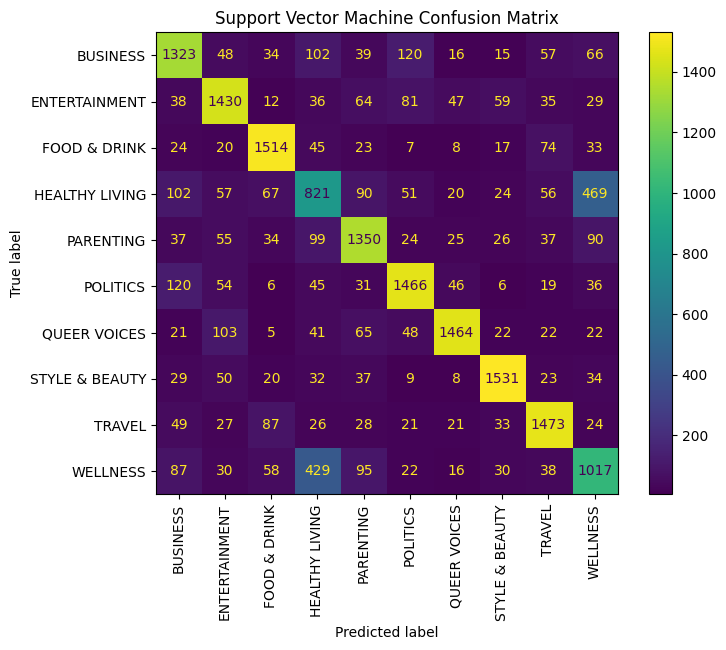
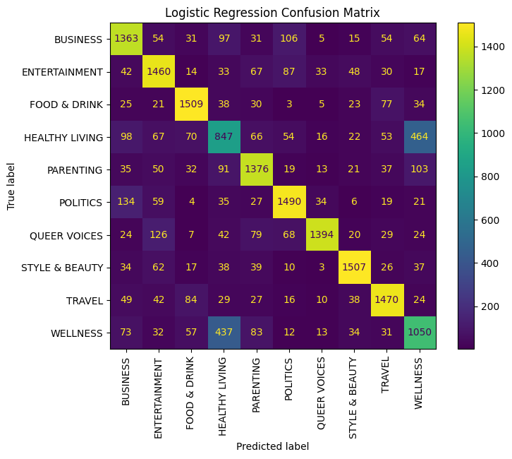
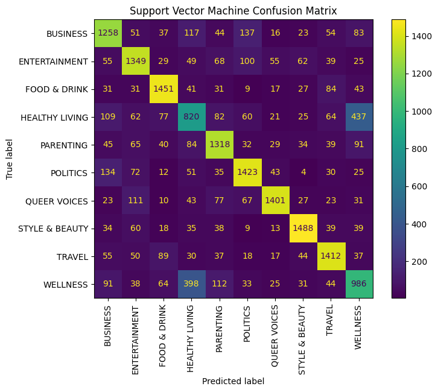
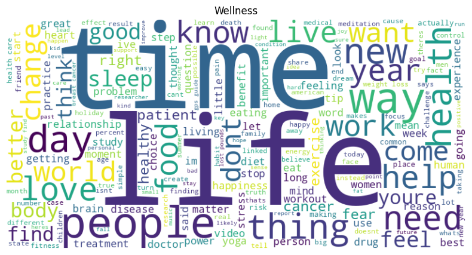
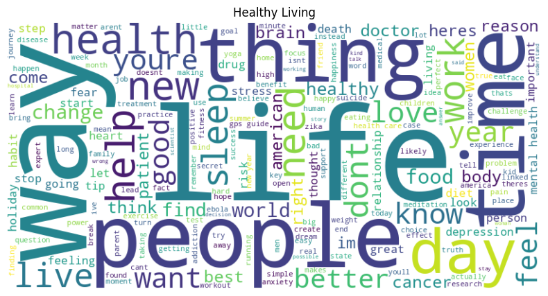

# News Article Classification

**Brittany D'Erasmo**

## Introduction

The purpose of this project was to build a multi-class classifier that can identify the category of news articles. Using Python libraries, two machine learning models were trained, tested and evaluated using existing labeled news articles, then optimized for improvement. The result provides insight to which version of the models would perform best in real-world applications such as content organization and recommendation systems.

## Dataset and Preprocessing

The dataset used for this project is the [News Category Dataset](https://www.kaggle.com/datasets/rmisra/news-category-dataset) found on Kaggle, which contains 209,527 entries. Each entry represents a news article and includes link, headline, category, short description, authors and date. For this project, only headline, short_description and category are considered, and category is used as the target variable.

There are 42 category values in the original dataset. Due to the scarcity of samples in most categories and increased computation needed with more than ten classes, only the ten most represented categories were used as classes, and samples belonging to the remaining categories were dropped. The value counts of the ten categories ranged from 5,592 to 35,602 samples per category. To avoid class bias and ensure that each class contributes equally to training, the dataset was further reduced and balanced to include 5,592 samples from each category, resulting in a new dataset of 59,920 samples, evenly distributed across Business, Entertainment, Food & Drink, Healthy Living, Parenting, Politics, Queer Voices, Style & Beauty, Travel and Wellness.

Next, some text processing was done. The text in the headline and short_description attributes was concatenated and converted to lowercase. Punctuation, numbers, special characters and unnecessary spaces were removed. Words were tokenized and stopwords were removed using the SpaCy library. The resulting input text contains an average of 16 tokens per sample. Word clouds were used to visualize the distribution of words in a few of the categories. In the Food & Drink category for example, 'recipe', 'food', 'cocktail' and 'photo' are common words, while in Politics, 'Donald', 'Trump', 'President' and 'Republican' are common words.

Finally, class labels were encoded and the dataset was split into 70% training and 30% test. Using the TF-IDF (Term Frequency-Inverse Document Frequency) method, the input data was converted into numerical matrices with a maximum of 5,000 features.

## Model Training and Evaluation

Using scikit-learn, a Logistic Regression and an SVM (Support Vector Machine) model was trained, tested and evaluated. The accuracy of these baseline models was ~73% and ~72% respectively. The models were also evaluated on per-class precision, recall and f1-score. A confusion matrix for each model shows high-range values of correct predictions (yellow and yellow-green) in most categories with mid-range values of correct predictions (blue-green and blue) in Healthy Living and Wellness.

|||
|---|---|
|  |  |

## Model Improvement

In a first attempt to improve accuracy, a Naive Bayes model was trained and evaluated, resulting in ~71% accuracy (no improvement). Next, cross-validation was performed on the baseline Logistic Regression, SVM and Naive Bayes models, resulting in ~72%, ~71%, and ~71% accuracy, respectively (little to no improvement). In the third improvement attempt, the TF-IDF feature limit was increased from 5,000 to 30,000, and the Logistic Regression and SVM models were retrained. This slightly improved the performance of both models, reaching ~75% and ~74% respective accuracy. A confusion matrix for each model shows an increase in correctly predicted labels across all categories.

| Model | Improvement Technique | Accuracy |
|---|---|---|
| Logistic Regression | Baseline | 0.7310 |
| SVM | Baseline | 0.7180 |
| Naive Bayes | Baseline | 0.7091 |
| Logistic Regression | Cross Validation | 0.7243 |
| SVM | Cross Validation | 0.7139 |
| Naive Bayes | Cross Validation | 0.7056 |
| Logistic Regression | Increased Max Features | 0.7491 |
| SVM | Increased Max Features | 0.7448 |

> **Best model:** Logistic Regression with `max_features=30000` — **0.7491 accuracy**

|||
|---|---|
|  |  |

## Observations

The best performing model is Logistic Regression trained with `max_features=30000`, achieving an accuracy score of nearly 75%. This is relatively high accuracy for a ten-class classification problem. The model still performed worse on predicting the Healthy Living and Wellness categories. This is likely due to the text in those categories having many words in common, as visualized in the word clouds below.

|||
|---|---|
|  |  |

Another limitation is that there is a small amount of text per training sample (headline + short_description includes only ~16 tokens on average). Additionally, word order is not considered by TF-IDF. Potential improvements include using data that includes entire articles or longer summaries, merging Healthy Living and Wellness categories, using bigrams and/or trigrams, and using word embeddings or transformer-based models (e.g., BERT) which understand word context and semantics.

## Conclusion

This project demonstrates how machine learning can be used to classify news articles by category. A large dataset of close to 60,000 news articles were processed and then used to train, test and evaluate a Logistic Regression and an SVM model. Three improvement methods were applied and resulted in the Logistic Regression model demonstrating the best prediction accuracy when trained on a maximum of 30,000 input features.
